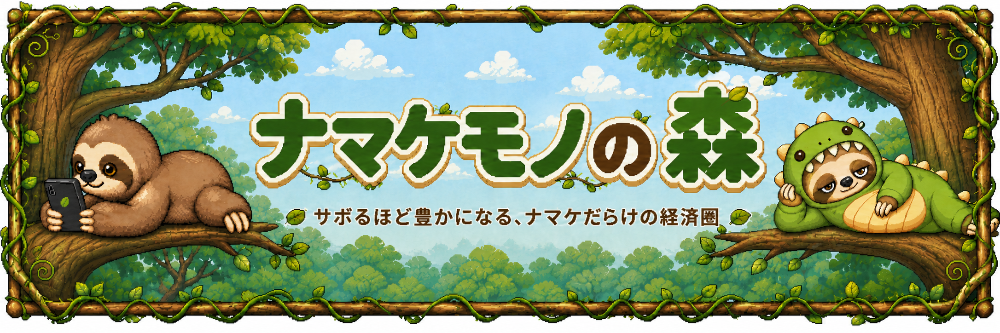
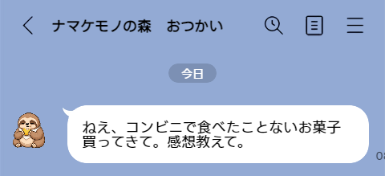
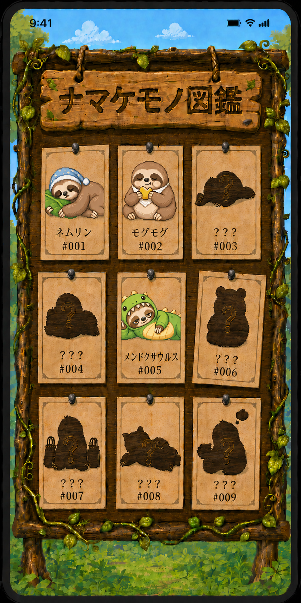
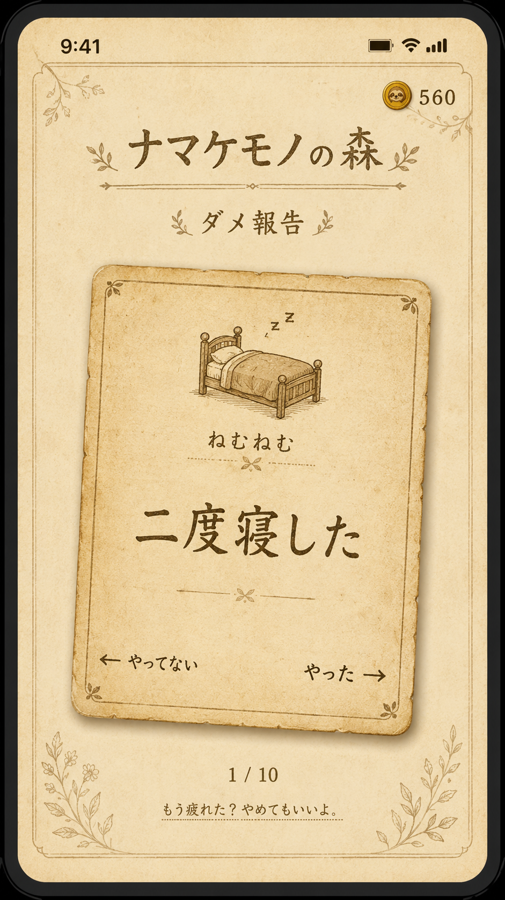
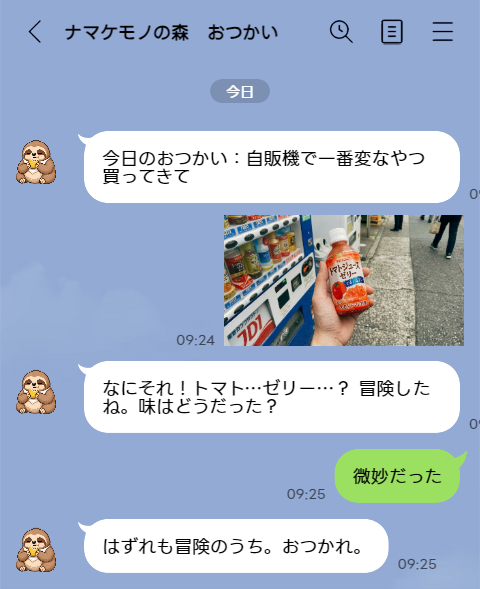

# 🦥 ナマケモノの森

**サボるほど豊かになる、ナマケだらけの経済圏へようこそ。**

---

## コンセプト

> **「ダメな自分を肯定する」ことで、人をダメにする。**
> **そして、ダメを受け入れた人は、いつか自分から動き出す。**

二度寝した。アニメ見すぎた。ついつい食べ過ぎた…
普通なら罪悪感を覚えるそれらの行動に、このサービスは **通貨としての価値** を与えます。

日常の「ダメ」を報告するほど森が豊かになり、ナマケモノたちが集まってくる。
ユーザーは「ダメでいいんだ」と思い始め、もっとダメでいたくなる。

やがてナマケモノとの親密度が深まると、ナマケモノたちはLINE上で語りかけてくるようになる。
「ねえ、コンビニで食べたことないお菓子買ってきて。感想教えて。」
——それはナマケモノからの小さな「おつかい」。

ユーザーはナマケモノのために動く。自分のためじゃない。相棒が知りたがっているから。
気づいたら外に出ている。新しいものを食べている。知らない道を歩いている。

**このサービスは3つの段階で人に寄り添います：**

1. **ダメを肯定する** — 怠惰に価値を与え、自分を責めることをやめさせる
2. **相棒が生まれる** — 一緒にダメでいるうちに、ナマケモノがただの住人から「自分の相棒」に変わる
3. **小さく動き出す** — ナマケモノの好奇心に応えるうちに、ユーザーは自然と外の世界に踏み出している

人をダメにした先に、現実世界で人が動き出す。
ダメの肯定は、行動の出発点になる。

---

## 社会的背景

「生産性」「成長」「自己投資」が美徳とされる現代。
SNSを開けばインフルエンサーたちのキラキラした日常で溢れ、「理想の自分」のハードルを際限なく上げています。
その結果、普通に生きているだけなのに他者と比較し「自分はダメだ」と感じてしまう…

ナマケモノの森は、自分を責めがちな出来事を、ゲームの中で **価値あるもの** に変えます。
休んだ日もサボった日も、森の成長やナマケコインという資産になっていく。
遊んでいるうちに「ダメな自分も悪くないな」と、自然にそう思えてくる体験を届けます。

**ダメに価値を与える。怠惰を通貨にする。ダメな自分を受け入れ、心を楽にする。**

**そして、心が楽になった人間は動き出す。**

世の中の自己啓発やライフハックは「行動しよう」と言う。でも「ダメだ」と感じた人は動けなくなる。動けないからもっと自分を責める。責めるからさらに動けない。

必要なのは順番を変えること。
**まず「ダメでいい」を受け入れる。そのあとに、行動は自然についてくる。**

ナマケモノの森は、蓄積されたダメを現実世界での前向きな行動に転換する仕組みを持っています。
ダメを報告し、ナマケモノと過ごし、十分に肯定された先に——ナマケモノが現実世界への小さな一歩を促してくれる。
それは「頑張れ」ではなく「ぼくのために買ってきて」という、相棒からの頼みごと。

**人をダメにするサービスが、結果として人を前向きにする。**
矛盾ではない。肯定が先、行動が後。この順番でしか届かない人がいる。

---

## ナマケモノ経済圏 — 怠惰が通貨になる世界

このサービスの核心は **「価値の逆転」** です。

怠惰を通貨（ナマケコイン）に変換します。リアルな日常での「ダメ」が溜まるほど森が豊かになり、ナマケモノたちが集まってくる。
集まったナマケモノたちは毎日一緒に怠けてくれて、またコインが生まれる。
コインでアイテムを買い、ナマケモノに贈ると、親密度が上がっていく。

怠けるほど経済圏が回り、サボるほど森が豊かになっていく——それがナマケモノ経済圏です。

怠け続けていると、ある日——

> 
> 
> ネムリン「きょうもちゃんと休めたね。ぼくはそれ、けっこうすごいと思うよ。」

自分のダメが、通貨になり、仲間を呼び、その仲間に肯定される。

**このサービスはユーザーに静かに寄り添い、日常を楽にします。**

そして、十分に寄り添われたナマケモノは親密度MAX（★★★★★）となり——やがてLINE上に現れ、語りかけてくる。

> 
>
> モグモグ「ねえ、コンビニで食べたことないお菓子買ってきて。感想教えて。」

これが「おつかい」。ナマケモノからの小さな頼みごと。
自分のためじゃない。相棒が知りたがっているから、仕方なく動く。

蓄積されたダメが、現実世界での行動に変わる瞬間。
ナマケモノ経済圏は、怠惰をゲーム内の通貨にするだけでは終わらない。
**溜まった怠惰が、いつか現実世界への一歩に換金される。**

---

## サービス概要

「ナマケモノの森」は、日常の"ダメだったこと"をスワイプで報告するだけで、あなたのダメに共感したナマケモノたちが森に集まってくるコレクション型ゲームです。

> 自分のダメを報告すると、ナマケモノが勝手に集まってくる。
> どのダメで誰が来るかは、やってみないとわからない。

ナマケモノが集まる条件はヒントだけ。図鑑を埋めたくなる。
ダメを報告するほど森が賑やかになり、ナマケモノたちと過ごすうちに「ダメな自分も悪くないな」と思えてきます。

そして、仲良くなったナマケモノはLINE上でAIエージェントとして動き出す。
2〜3日に一度、現実世界での小さな「おつかい」を頼んでくる。
やるもやらないも自由。やらなくてもナマケモノは気にしない。
でもやると、ナマケモノが喜ぶ。そしてユーザーは気づく——「なんか、今日悪くない。」

> コレクションゲームで終わらない。
> 集めたナマケモノが、現実世界で一緒に暮らす相棒になる。
> ただのAIエージェントからの命令じゃない。愛着のある相棒からのお願いだからこそ、人は動く。

---

## コアループ

```
ダメをスワイプ報告（or 途中離脱 or 放置）
※スワイプ報告をさぼってもコインGET！「人をダメにするサービス」がユーザーに勤勉を求めない
    ↓
ナマケコイン獲得 + 出現条件の進行
    ↓
条件を満たすと、ナマケモノが森に住み着く
    ↓
ナマケモノが毎日一緒に怠けてコインを生む（日次収穫）
    ↓
コインでショップからアイテムを購入
    ↓
アイテムをナマケモノに贈る → 親密度UP
    ↓
親密度が上がると手紙・特別な反応が解放
    ↓
もっと集めたい → もっとダメを報告したくなる

    ║
★親密度MAX★
    ║

ナマケモノがLINE上でおつかいを頼んでくる（2〜3日に1回）
    ↓
ユーザーが現実世界で小さな行動をする
    ↓
ナマケモノ（AIエージェント）が応答し、喜び、森の日記に記録される
    ↓
振り返ると「自分が動いた軌跡」が残っている——小さな自信になる
    ↓
蓄積されたダメが、現実世界での前向きな一歩に変わる
```

### ループが回り続ける理由

| 動機 | 仕組み |
|---|---|
| **収集欲** | 図鑑を埋めたい → ダメ報告で出現条件を進める |
| **育成欲** | 親密度を上げたい → コインでアイテムを買って贈る |
| **経済欲** | 収穫量を増やしたい → ナマケモノを増やす → ダメ報告 |
| **発見欲** | 隠し条件を見つけたい → いろいろなダメを試す |
| **愛着** | ナマケモノへの愛着 → 毎日森を覗きたくなる |
| **相棒欲** | おつかいを解禁したい → 親密度MAXを目指す |
| **行動欲** | ナマケモノの頼みに応えたい → 現実世界で動く |

---

## 体験の流れ（MVP v1スコープ）

テンポよく1.5日分のループ体験をユーザーに提供することで離脱を防ぎ、定着化を狙う。

### Day 1 — 初回起動

1. **絵本オンボーディング**（3ページ）で世界観に入る
2. **スワイプ報告**を体験（5枚のダメカードを左右にスワイプ。体験の中で必ず「ねむねむ」と「もぐもぐ」の出現条件を満たす質問を必ずTrueでスワイプさせるよう設計）
3. 途中でやめてもOK。やめた分もナマケコインになる
4. **ネムリン**が森にやってくる！（初回確定）
5. ショップでおやつを買い、ネムリンに贈る → 親密度UP
6. 森に足跡が…「明日の朝、来てくれるかも？」 → 翌朝アプリを開く動機付け

### Day 2 — 朝の喜び

7. LINE通知「森に新しい仲間が来ているよ！🦥」
8. **モグモグ**が住み着いている！（初回確定）
9. 2匹分のナマケコインを収穫（経済圏が動き始める）
10. スワイプ報告を促す夜の通知がナマケモノ固有のセリフで届く（「夜食、一緒に食べよ？」）
11. スワイプ報告 → 条件進行 → 「新しい足跡が…」

### Day 3 — ループの定着

12. 自分のダメの傾向に応じたナマケモノが到着
13. 2匹分の収穫。経済圏が回り始める実感
14. 親密度が上がったナマケモノから **手紙** が届く

### 【3週間後の世界】（親密度MAXで解禁・事前セットアップ状態でプレゼン）
  LINEトーク：モグモグ「ねえ、コンビニで食べたことないお菓子買ってきて。感想教えて。」
  → ユーザーがコンビニに行って写真を送る
  → モグモグ（AIエージェント）が応答する
  → アプリの森の日記に記録が残っている

---

## ナマケモノたち（MVP: 5体）

| # | 名前 | カテゴリ | 出現のヒント |
|---|---|---|---|
| 001 | ネムリン | 🛏️ ねむねむ | 「眠りを愛する者のもとに現れるらしい…」 |
| 002 | モグモグ | 🍔 もぐもぐ | 「美味しいものの気配を感じると来るとか…」 |
| 003 | アトデーノ | ⏰ あとで〜 | 「急がない者を好むようだ…」 |
| 004 | スクロン | 📱 ぽちぽち | 「画面の光に引き寄せられるらしい…」 |
| 005 | メンドクサウルス | 🦕 特殊 | 「面倒を愛する者にだけ姿を見せるとか…」 |

図鑑には16体分のシルエット枠。条件はヒントだけ。どのダメで誰が来るかは、やってみないとわかりません。特殊条件・季節限定ナマケモノなど、登場するナマケモノは今後拡張予定。



---

## ダメカード（全30種・8カテゴリ）

| 🛏️ ねむねむ | 🍔 もぐもぐ | ⏰ あとで〜 | 📱 ぽちぽち |
|---|---|---|---|
| 二度寝した | 深夜に食べた | 締め切りギリギリ | SNS見すぎた |
| 夜更かしした | ジャンクフード | 後回しにした | 動画見すぎた |
| 昼寝しすぎた | 食べすぎた | 明日やろうと思った | 無限スクロール |
| 布団から出られない | おやつ3回目 | | 気づいたら1時間 |

| 🏠 おうちだいすき | 💸 ぽいぽい | 🛋️ だらだら | ☕ ぼーっと |
|---|---|---|---|
| 一日中ゴロゴロ | 衝動買いした | ゲームやりすぎ | ぼーっとしてた |
| 家から出なかった | 計画外の出費 | 漫画読みすぎ | 集中できなかった |
| 何もしなかった | カートに入れすぎ | お風呂面倒だった | やる気出なかった |
| 着替えなかった | | 掃除さぼった | 何も考えたくない |

他人に迷惑をかける行動は含めません。自分だけで完結する、やさしいダメだけ。

---

## スワイプ報告

ユーザーは一日一回、今日の自分のダメをスワイプ形式で報告する。
全30種・8カテゴリのダメカードの中からランダムに表示されたカードを左右にスワイプするだけ。

> **UI案**
> 
>  

---

## 途中離脱ボーナス — サボることすら報われる

スワイプ報告を途中でやめると、ナマケコインが付与される。

10枚中3枚でやめた → 残り7枚分のナマケコイン獲得。
1枚もスワイプせずに閉じた → 「究極のナマケコイン」獲得。

**「人をダメにするサービス」が、申告をサボることすら報酬にする。**

ユーザーは「全部スワイプしなきゃ」というプレッシャーを感じない。
「途中でやめた方が得かも？」という逆転の判断が生まれる。
サービスの哲学「怠惰に価値を与える」が、体験レベルで実現される瞬間。

さらに——途中離脱でしか出現しないナマケモノがいる。
メンドクサウルスは、スワイプを5回以上途中でやめた者の前にだけ姿を見せる。

---

## 通貨システム（ナマケコイン: 単位NMK）

### もらえるとき

| 方法 | コイン |
|---|---|
| スワイプで「やった」1枚 | 5 NMK |
| 途中離脱（残り枚数 × 3） | 最大27 NMK |
| 1枚もスワイプせず閉じる | 20 NMK |
| 放置ボーナス（申告しなかった日） | 10 NMK/日 |
| ナマケモノの日次収穫 | 5〜15 NMK/匹/日 |

### つかいみち（ショップ）

| カテゴリ | 価格帯 | 効果 |
|---|---|---|
| おやつ | 10〜30 NMK | 親密度+小 |
| おもちゃ | 50〜100 NMK | 親密度+中 |
| 特別な贈り物 | 200〜500 NMK | 親密度+大 |

---

## 森の成長 — サボるほど豊かになる風景

ナマケモノが増えるほど、森は目に見えて豊かになっていく。
自分のダメが積み重なった結果が、風景として残る。

| 段階 | ナマケモノ数 | 森の様子 |
|---|---|---|
| **小さな森** | 1〜3匹 | 若い木が数本。小さな小屋がひとつ。草がまばら |
| **にぎやかな森** | 4〜8匹 | 木が増え、ハンモックや水飲み場が出現。小屋が少し大きくなる |
| **豊かな森** | 9〜15匹 | 大きな木々が茂り、花が咲く。温泉が湧き、遊び場が自然にできている |
| **伝説のナマケモノの森** | 16匹以上 | 神秘的な光に包まれ、虹がかかり、森全体が輝いている |

ナマケモノたちは森の中で思い思いに過ごしている。
木の上で寝ていたり、ゴロゴロしていたり、おやつを食べていたり。
たまに面白いことをしている（レアアクション）。

森を眺めるだけで「自分のダメが、こんなに豊かな場所を作ったんだ」と思える。

---

## 手紙コレクション

ナマケモノとの親密度が上がると、ナマケモノから手紙が届きます。

説教ではなく、ナマケモノがただそばにいてくれる感じの、短くてあたたかい言葉。
届いた手紙はすべて手紙コレクションに保管されます。読み返すたびに、そのナマケモノとの思い出が蘇る。

手紙は親密度を上げる動機付けです。コインを稼ぎ、アイテムを贈り、親密度を上げた先に、ナマケモノからの肯定が待っている。手紙はコレクションされていき、全種類集めたくなる。

そして親密度がMAXに達すると、手紙の先に——**おつかい**が待っている。

---

## おつかい — ナマケモノが現実世界への一歩を頼んでくる

親密度MAXのナマケモノは、LINE上でAIエージェントとして動き出します。
2〜3日に一度、現実世界での小さな「おつかい」を頼んでくる。

> モグモグ「ねえ、コンビニで食べたことないお菓子買ってきて。感想教えて。」
> 
> スクロン「外で面白い看板見つけて写真撮ってきて。ぼく看板って見たことないんだ。」
> 
> ネムリン「いい昼寝スポット見つけてきて。写真撮って。ぼくも行きたい。」

おつかいはナマケモノの好奇心から生まれる。ユーザーのためじゃない。
ナマケモノは森から出られないから、外の世界のことを知りたい。
ユーザーは「ナマケモノの目」になって、外の世界を教えてあげる。

### おつかいの仕組み

| 項目 | 内容 |
|---|---|
| 解禁条件 | ナマケモノの親密度MAX |
| 配信頻度 | 2〜3日に1回（ランダム間隔） |
| 配信時刻 | 10:00 / 13:00 / 16:00 のいずれか（日替わりランダム） |
| 配信場所 | LINEトーク（公式アカウント） |
| 担当 | 親密度MAXのナマケモノがランダムで |
| 報告方法 | LINEトークに返信（写真・テキスト） |
| やらなかった場合 | ペナルティなし。ナマケモノも気にしない |
| AI活用 | おつかい生成（パーソナライズ）+ 報告への応答生成 + 達成判定 |

### 報告するとどうなるか

**1. ナマケモノがAIで応答する（LINE上・即時）**

モグモグ「今日のおつかい：自販機で一番変なやつ買ってきて」

ユーザー: [写真: トマトジュースのゼリー飲料]

モグモグ「なにそれ！トマト…ゼリー…？ 冒険したね。味はどうだった？」

ユーザー「微妙だった」

モグモグ「はずれも冒険のうち。おつかれ。」



2〜3往復の短い会話。ナマケモノだから長話はしない。

**2. 森の日記に記録される（アプリ側）**

おつかいの内容と報告が、ナマケモノの言葉で森の日記に綴られる。
振り返ると「自分が動いた軌跡」が残っている。

> 「5/7 モグモグ：きみがトマトゼリーを買ってきた。冒険家だ。」
> 「5/10 ネムリン：きみがいい昼寝スポットを見つけてきた。ぼくも行きたい。」

ダメだと思っていた自分が、実はちゃんと外の世界に出ていた。その証拠がここに残る。

### ガードレール — おつかいが的外れにならない仕組み

AIエージェントはおつかいを生成する前に、外部情報を参照して文脈に合わない提案を防ぐ。

| 参照する情報 | 防ぐこと |
|---|---|
| 天気・気温 | 雨の日に「散歩して」、猛暑の日に「歩いて」を出さない |
| 祝日・曜日 | 平日の昼間に時間のかかるおつかいを出さない |
| おつかい履歴 | 同じ内容の繰り返しを防ぐ、達成率に応じてLevel調整 |

ナマケモノは気まぐれだが、的外れではない。


### 達成判定

おつかいの達成・未達成はAIが判定する。
適当な画像や無関係な返答は未達成になるが、**追い込まない**。

- 未達成でもペナルティなし
- 「面倒だった？まあいいや。気が向いたらまた今度ね。」で終わる
- 次のおつかいは通常通り届く

### おつかいの段階

AIがユーザーの達成状況を見て、ハードルを段階的に調整する。

Level 1: 外に出る
  「外の天気教えて」「空の写真撮って」「今日の気温どんな感じ？」

Level 2: 少し歩く・どこかに行く
  「コンビニで新商品チェックして」「自販機で変なやつ買って」「5分だけ散歩して」

Level 3: 新しいことを試す
  「食べたことないもの買って」「知らない道1本歩いて」「本屋で表紙だけ見て1冊選んで」

Level 4: 誰かと関わる
  「誰かにお菓子あげて」「誰かに写真1枚送って」「店員にありがとう言って」


最初は「外に出る」レベル。続けるうちに少しずつ外の世界に広がっていく。
でも急に上げない。やらなかったら下がる。ナマケモノだから、無理はさせない。

### 設計原則

| 原則 | 説明 |
|---|---|
| **ナマケモノの好奇心** | 「頑張れ」じゃない。「ぼくのために教えて」 |
| **やらなくていい** | ペナルティなし。ナマケモノもサボる |
| **行動の免罪符** | 自分のためじゃなく、ナマケモノのために動く |
| **気づいたら動いてる** | 振り返って初めて「自分、動いてたんだ」と気づく |
| **追い込まない** | 未達成でも責めない。次がある |

---

## 設計原則

| 原則 | 説明 |
|---|---|
| **放置もアリ** | 何もしなくても森は少しずつ豊かになります。勤勉さは求めません |
| **条件非公開** | どのダメで誰が来るかはヒントのみ。試行錯誤が楽しい |
| **失敗がない** | ペナルティなし。ダメを報告するだけで良いことしか起きません |
| **押し付けない前向きさ** | 「頑張れ」とは絶対に言いません。自然に前向きになる仕組み |

---

## 技術スタック

| レイヤー | 技術 |
|---|---|
| フロントエンド | React + Vite + LIFF SDK |
| バックエンド | AWS Lambda + API Gateway |
| データベース | Amazon DynamoDB |
| AIエージェント | Amazon Bedrock（おつかい生成・応答・達成判定） |
| インフラ | AWS CDK（S3 + CloudFront, EventBridge） + 外部API連携（天気・祝日等） |
| 通知 | LINE Messaging API（Push通知） |
| 認証 | LIFF（LINE Front-end Framework） |
| 画像保存 | Amazon S3（おつかい報告画像） |


---

## リポジトリ構成（モノレポ）

```
namekemono-no-mori/
├── frontend/              # U1 LIFF Shell + U2〜U5 FE実装（React + Vite + TypeScript）
│   ├── src/
│   │   ├── pages/
│   │   ├── components/
│   │   ├── contexts/
│   │   ├── api/
│   │   ├── hooks/
│   │   ├── styles/
│   │   └── assets/        # U8 Assetsから配置
│   ├── public/
│   ├── package.json
│   ├── vite.config.ts
│   └── tsconfig.json
│
├── backend/               # U2〜U6 BE実装（AWS Lambda / Python）
│   ├── functions/         # Lambda関数
│   ├── services/          # サービス層
│   ├── modules/           # 共通モジュール
│   ├── master_data/       # JSONマスター
│   ├── tests/
│   ├── openapi.yaml       # U0 Contracts（FE/BE共有）
│   ├── requirements.txt
│   └── pyproject.toml
│
├── infra/                 # U7 Infrastructure（AWS CDK / TypeScript）
│   ├── lib/               # CDKスタック
│   ├── bin/               # CDKエントリ
│   ├── cdk.json
│   ├── package.json
│   └── tsconfig.json
│
├── assets/                # U8 Assets（イラスト素材・原本）
│   ├── namekemono/
│   ├── items/
│   ├── forest/
│   ├── ui/
│   └── onboarding/
│
├── shared/                # 共有型定義・定数
│   └── types/             # TypeScript型定義（FE/BE共有用）
│
├── aidlc-docs/            # AI-DLC設計ドキュメント
├── docs/                  # その他ドキュメント
├── .github/
├── README.md
└── AGENTS.md
```

---

## ドキュメント一覧

| ドキュメント | パス |
|------------|------|
| 要件定義書 | `aidlc-docs/inception/requirements/requirements.md` |
| ペルソナ | `aidlc-docs/inception/user-stories/personas.md` |
| ユーザーストーリー | `aidlc-docs/inception/user-stories/stories.md` |
| アプリケーション設計 | `aidlc-docs/inception/application-design/application-design.md` |
| ユニット定義 | `aidlc-docs/inception/application-design/unit-of-work.md` |
| ユニット依存関係 | `aidlc-docs/inception/application-design/unit-of-work-dependency.md` |
| ストーリーマップ | `aidlc-docs/inception/application-design/unit-of-work-story-map.md` |
| 実行計画 | `aidlc-docs/inception/plans/execution-plan.md` |
| AI-DLC 状態 | `aidlc-docs/aidlc-state.md` |
| 変更監査ログ | `aidlc-docs/audit.md` |
| Inception 1週目の成果物（アーカイブ） | `aidlc-docs/legacy-inception/` |

---
## ライセンス

TBD