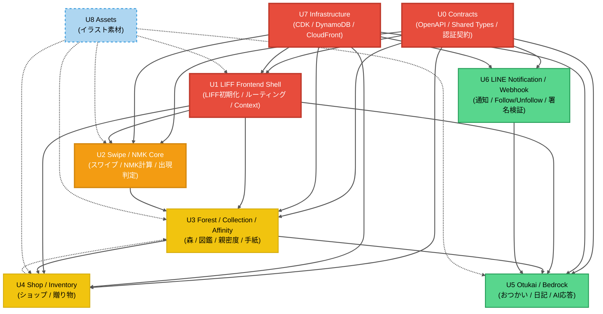

# Unit of Work Dependency — ナマケモノの森（改訂版）

## 論理 Unit 間の依存 DAG



**凡例**:
- 🔴 赤（Tier 1 最優先）: U0, U7, U1
- 🟠 橙（Tier 2）: U2
- 🟡 黄（Tier 3）: U3, U4
- 🟢 緑（Tier 4）: U5, U6
- 🔵 青破線（独立並列）: U8
- 実線矢印: 必須の依存関係
- 点線矢印: 差し替え可能（プレースホルダーで暫定運用可）／補助的依存

---

## 依存関係マトリクス（論理 Unit × 論理 Unit）

行: 依存される側（上流） / 列: 依存する側（下流）

| | U0 | U1 | U2 | U3 | U4 | U5 | U6 | U7 | U8 |
|---|:---:|:---:|:---:|:---:|:---:|:---:|:---:|:---:|:---:|
| **U0 Contracts** | — | ○ | ○ | ○ | ○ | ○ | ○ | — | — |
| **U1 LIFF Shell** | — | — | ○ | ○ | ○ | ○ | — | — | — |
| **U2 Swipe/NMK** | — | — | — | ○ | — | — | ◎ | — | — |
| **U3 Forest/Affinity** | — | — | — | — | ○ | ◎ | ◎ | — | — |
| **U4 Shop** | — | — | — | ◎ | — | — | — | — | — |
| **U5 Otukai** | — | — | — | — | — | — | — | — | — |
| **U6 LINE** | — | — | — | — | — | ○ | — | — | — |
| **U7 Infra** | — | ○ | ○ | ○ | ○ | ○ | ○ | — | — |
| **U8 Assets** | — | △ | △ | △ | △ | △ | — | — | — |

**凡例**:
- ○ 実装依存（上流が完成していないと下流の実装がブロックされる）
- ◎ 実行時依存（データや機能参照。契約さえあれば並列実装可）
- △ プレースホルダー代替可（最終成果物の差し替えで統合）

---

## 優先度 Tier とクリティカルパス

### Tier 1（最優先・ブロッカー）: U0 + U7 スケルトン + U1 骨格

これらが動かないと全ての後続 Unit が着手できない、あるいは動作確認できない。

| Unit | 期限目安 | 完了基準（Tier 1 脱出条件） |
|---|---|---|
| U0 Contracts | Day 1 終了時 | `openapi.yaml` 初版と `shared/types/` が存在し、A がレビュー済 |
| U7 Infra スケルトン | Day 2 終了時 | CloudFront URL が動き、DynamoDB 5 テーブルが存在し、Lambda デプロイパイプが動く |
| U1 LIFF Shell | Day 3 終了時 | LIFF として起動し、7 画面のルーティングと 3 Context が揃い、API クライアント骨格がある |

### Tier 2: U2 Swipe / NMK Core

MVP 体験の中核で、後続ほぼ全てが NMK を前提とする。

| Unit | 期限目安 | 完了基準 |
|---|---|---|
| U2 Swipe/NMK Core | Day 5 終了時 | スワイプ 10 枚 UI、途中離脱、NMK 獲得、出現条件進行、pendingAppearances 登録が E2E で動作 |

### Tier 3: U3 Forest + U4 Shop（並列可）

Tier 2 の成果を使い、親密度・ショップ経済圏が成立する層。

| Unit | 期限目安 | 完了基準 |
|---|---|---|
| U3 Forest/Collection/Affinity | Day 8 終了時 | 森画面・図鑑・日次収穫・親密度・手紙が動作 |
| U4 Shop/Inventory | Day 7 終了時 | ショップ購入・贈り物・親密度上昇が動作 |

### Tier 4: U5 Otukai + U6 LINE（並列可）

MVP v1 の最終機能。他 Unit が揃ってから安心して着手できる。

| Unit | 期限目安 | 完了基準 |
|---|---|---|
| U5 Otukai/Bedrock | Day 11 終了時 | dev-api 経由でおつかい生成→LINE 会話→森の日記までが動作 |
| U6 LINE Notification/Webhook | Day 10 終了時 | Follow/Unfollow、夜通知、朝通知が動作。Webhook 署名検証と dispatch が動作 |

### 独立並列: U8 Assets

他 Unit のスケジュールと独立。早期に Tier 1〜2 のキャラ優先（ネムリン、モグモグ）。

---

## クリティカルパス

```
Day 1: U0 Contracts ─┐
                      ├─→ Day 2-3: U1 LIFF Shell
Day 1-2: U7 Skeleton ─┘         │
                                ▼
                      Day 3-5: U2 Swipe/NMK Core
                                │
                  ┌─────────────┼─────────────┐
                  ▼                            ▼
         Day 5-8: U3 Forest          Day 5-7: U4 Shop
                  │                            │
                  └─────────────┬──────────────┘
                                ▼
                  Day 8-11: U5 Otukai + U6 LINE 並列
                                │
                                ▼
                      Day 11-14: 統合・デモ磨き込み
```

**クリティカルパス長**: Day 1 → Day 11（実装完了）→ Day 14（デモ磨き込み）

**並列度**:
- U0 と U7 は Day 1 から B が兼務で並行（U0 は文書作業、U7 は CDK 実装）
- Tier 2 完了後、U3 と U4 は同時並行可能
- Tier 4 の U5 と U6 は同時並行可能
- U8 Assets は常時並列

---

## 物理担当の並列性分析

### メンバー A（今野さん / FE 専任）の時系列

| 期間 | 担当 Unit（FE 側） | 内容 |
|---|---|---|
| Day 1 | U0 レビュー | OpenAPI と型定義を FE 視点でレビュー |
| Day 2-3 | U1 LIFF Shell | プロジェクト初期化、LIFF 初期化、ルーティング、Context |
| Day 3-5 | U2 FE | スワイプ UI、途中離脱、コイン表示 |
| Day 5-8 | U3 FE | 森画面、図鑑、手紙コレクション、演出 |
| Day 5-7 | U4 FE（U3 と並行可） | ショップ、所持品ダイアログ |
| Day 8-10 | U5 FE（軽め） | 森の日記画面 |
| Day 11-14 | 統合・演出磨き込み | アニメーション、画像差し替え、デモ動画撮影用調整 |

### メンバー B（PM / フルスタック + AWS）の時系列

| 期間 | 担当 Unit | 内容 |
|---|---|---|
| Day 1 | U0 + U7 並行 | OpenAPI 設計、CDK 骨格、DynamoDB スキーマ設計 |
| Day 2 | U7 スケルトン | CloudFront + S3, DynamoDB 5 テーブル、Lambda デプロイパイプ |
| Day 3-5 | U2 BE + U7 拡張 | swipe-api、GameCore、マスターデータ、API Gateway 統合 |
| Day 5-7 | U4 BE + U3 BE 一部 | shop-api、affinity-api、ShopService |
| Day 5-8 | U3 BE | forest-api、日次収穫、pendingAppearances 実体化、encyclopedia-api |
| Day 8-10 | U6 | line-client、夜通知、朝通知、Webhook、EventBridge |
| Day 8-11 | U5 | Bedrock 連携、おつかいスケジューラ、画像処理、ガードレール |
| Day 11-12 | dev-api、統合テスト | 手動トリガー API、E2E 確認 |
| Day 12-14 | デモ環境安定化 | 動画撮影用データ投入、最終デバッグ |

### メンバー C（画像制作）の時系列（非同期）

| 期間 | 担当 | 優先順 |
|---|---|---|
| Day 1-3 | ネムリン、モグモグ | Tier 1 デモシナリオで最優先 |
| Day 4-7 | アトデーノ、スクロン、メンドクサウルス、アイテムアイコン | Tier 2-3 で必要 |
| Day 8-10 | 森背景、UI 素材 | Tier 3-4 で必要 |
| Day 11-12 | オンボーディング絵本 | 最終仕上げ |
| Day 13-14 | 調整 | デモ動画撮影用 |

### 並列性の評価

- **Day 1-2**: B は U0 + U7 を並行（どちらも設計作業で混在可能）、A は待機または先行学習、C は画像制作開始 → 並列度 ◯
- **Day 3-5**: A = U1 完了→U2 FE、B = U2 BE + U7 拡張、C = 画像制作 → **並列度 ◎**
- **Day 5-8**: A = U3 FE + U4 FE、B = U3 BE + U4 BE、C = 画像制作 → **並列度 ◎**
- **Day 8-11**: A = U3/U4 磨き込み + U5 FE、B = U5 + U6 並行、C = 画像制作 → 並列度 ○
- **Day 11-14**: 全員統合・磨き込み → 並列度は落ちるが目的が統合なので問題なし

---

## Fallback 計画（大枠）

担当者単位で稼働停止シナリオを想定し、引き継ぎ方針を明記する。

### ケース1: メンバー A（今野さん / FE 専任）が稼働停止

- **影響範囲**: U1 LIFF Shell、U2〜U5 の FE 側
- **引き継ぎ先**: メンバー B（フルスタック、FE も対応可）
- **引き継ぎコスト**: 低（B は FE も書ける）。ただし B の BE/Infra 時間が削られるため、全体スケジュールは 1-2 日遅延の見込み
- **ミティゲーション**:
  - 画面ごとに独立した PR を保つ（A の未完了画面を B が引き継ぎやすく）
  - コンポーネント粒度を細かく保ち、途中引き継ぎを可能にする

### ケース2: メンバー B（PM / フルスタック+AWS）が稼働停止

- **影響範囲**: U0 Contracts、U2〜U6 の BE 側、U7 Infra、U5 Bedrock 連携 → **ほぼ全 Unit**
- **引き継ぎ先**: メンバー A（AWS 初心者）
- **引き継ぎコスト**: 高（AWS 学習コストが大きい）。全体スケジュールは 3-5 日遅延し、MVP v1 の機能削減が必要になる可能性
- **ミティゲーション（最重要）**:
  - U0 Contracts と CDK は早期に整え、A が参照可能な状態に保つ
  - Bedrock / LINE 連携の設計を文書化し、コードコメントを厚めに
  - 最悪シナリオ: U5 おつかい機能を MVP v1 から外し、親密度 MAX 到達→手紙までで切る（デモ動画は事前セットアップ状態で撮影）

### ケース3: メンバー C（画像制作）が稼働停止

- **影響範囲**: U8 Assets
- **引き継ぎ先**: メンバー A/B（最悪時）
- **引き継ぎコスト**: 中（A/B は画像制作スキルに劣る）
- **ミティゲーション**:
  - 画像生成 AI（例: DALL-E, Stable Diffusion）で代替素材を生成
  - トンマナは落ちるが、デモ動画撮影は成立する
  - U8 は元々独立並列 Unit で、プレースホルダー運用を前提としているため、実装進捗への影響は小さい

---

## OpenAPI 契約（U0）による並列開発の成立条件

U2〜U5 は FE（A）と BE（B）の並列実装を前提とする。これを成立させる仕組み:

1. **契約先行**: U0 Contracts が Day 1 末までに全 API の I/O を OpenAPI で固める
2. **型共有**: `shared/types/` に TypeScript 型を置き、FE/BE 両方が同じ型を参照
3. **モック戦略**: FE は BE 完成前に、MSW（Mock Service Worker）や axios-mock で開発を進められる
4. **統合タイミング**: 各 Unit の FE/BE が完成したら、FE のモックを外して実 API に接続

### 契約変更のハンドリング

契約変更が発生した場合（例: A が FE 実装中に I/O 追加が必要と気づく）:

1. A が `backend/openapi.yaml` に PR を出す（B がレビュー）
2. B が承認し、`shared/types/` を更新
3. 双方の実装を更新
4. 変更は audit.md には残さず（粒度が細かすぎる）、PR 履歴と OpenAPI 差分で追跡

---

## 環境変数による統合

インフラ情報（U7）を他 Unit に注入する仕組み:

| 変数 | 用途 | 提供元 | 消費先 |
|---|---|---|---|
| `API_GATEWAY_URL` | REST API のベース URL | U7 | U1 (frontend build) |
| `LIFF_ID` | LIFF チャネル ID | U7 | U1 |
| `CLOUDFRONT_URL` | SPA 配信 URL | U7 | LIFF チャネル設定時に使用 |
| `USERS_TABLE`, `USER_NAMEKEMONO_TABLE`, etc. | DynamoDB テーブル名 | U7 | U2〜U6 Lambda |
| `IMAGES_BUCKET` | おつかい画像保存 S3 バケット | U7 | U5 Lambda |
| `LINE_CHANNEL_SECRET`, `LINE_CHANNEL_ACCESS_TOKEN` | LINE API 認証 | U7 (Secrets Manager) | U6 Lambda |
| `BEDROCK_MODEL_ID` | Bedrock モデル ID | U7 | U5 Lambda |

注入方法:
- **Lambda**: CDK で環境変数としてセット
- **Frontend**: Vite のビルド時環境変数（`VITE_*` prefix）

---

## リスクと緩和策

| リスク | 発生確率 | 影響 | 緩和策 |
|---|---|---|---|
| OpenAPI の設計ミスで FE/BE の契約が合わない | 中 | 中 | U0 を Day 1 に早期確定、A/B 双方でレビュー |
| U7 Infra スケルトンの遅延で他 Unit が着手できない | 低 | 高 | B が Day 1-2 を最優先で確保 |
| A が LIFF に詰まる | 中 | 中 | B が LIFF 仕様の事前調査を Day 0 に実施、初期化コードは B がサポート |
| Bedrock のレスポンス品質が想定より低い | 中 | 中 | プロンプトチューニングの時間を U5 に確保、最悪時はテンプレート応答で代替 |
| 画像素材の納品遅延 | 中 | 低 | プレースホルダーで開発継続、最悪時は生成 AI で代替 |
| B に作業が集中しボトルネック化 | 高 | 中 | U0 と U7 を可能な限り早期完了させ、B のリソースを後半に温存 |
