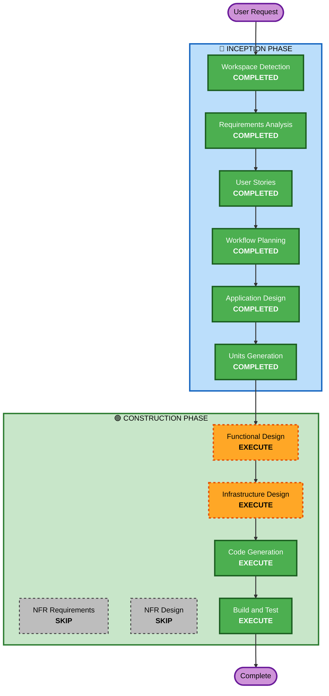

# Execution Plan

## Detailed Analysis Summary

### Change Impact Assessment
- **User-facing changes**: Yes — 新規ゲームアプリ全体
- **Structural changes**: Yes — フロントエンド + バックエンド + インフラの新規構築
- **Data model changes**: Yes — DynamoDBテーブル設計が必要
- **API changes**: Yes — 全APIを新規設計
- **NFR impact**: 最小限（ハッカソンデモ用途、〜5ユーザー）

### Risk Assessment
- **Risk Level**: Medium
- **主なリスク**: LIFF開発経験の不足、AI（Bedrock）統合の複雑さ、2週間の期間制約
- **Rollback Complexity**: Easy（新規プロジェクトのため）
- **Testing Complexity**: Simple（ユニットテストのみ、ハッピーパス中心）

---

## Workflow Visualization

---

## Phases to Execute

### 🔵 INCEPTION PHASE
- [x] Workspace Detection (COMPLETED)
- [x] Requirements Analysis (COMPLETED)
- [x] User Stories (COMPLETED)
- [x] Workflow Planning (COMPLETED)
- [x] Application Design (COMPLETED)
  - **Rationale**: 新規アプリ。コンポーネント構成、API設計、DynamoDBテーブル設計、サービスレイヤー定義が必要
- [x] Units Generation (COMPLETED)
  - **Rationale**: フロントエンド/バックエンド/インフラ/アセットの4ユニットに分割し、並列開発するため

### 🟢 CONSTRUCTION PHASE（per-unit）
- [ ] Functional Design - **EXECUTE**
  - **Rationale**: ゲームロジック（コイン計算、出現条件判定、親密度計算、おつかいAI）の詳細設計が必要
- [ ] NFR Requirements - **SKIP**
  - **Rationale**: ハッカソンデモ用途（〜5ユーザー）。パフォーマンス・スケーラビリティの詳細設計は不要
- [ ] NFR Design - **SKIP**
  - **Rationale**: NFR Requirementsをスキップするため
- [ ] Infrastructure Design - **EXECUTE**
  - **Rationale**: AWS CDK構成（Lambda、API Gateway、DynamoDB、S3、CloudFront、EventBridge）の設計が必要
- [ ] Code Generation - **EXECUTE**（ALWAYS）
  - **Rationale**: 実装コード生成
- [ ] Build and Test - **EXECUTE**（ALWAYS）
  - **Rationale**: ビルド・テスト手順の生成

---

## Success Criteria
- **Primary Goal**: 1.5日体験が動作するMVPをAWSにデプロイし、プレゼン動画を撮影できる状態にする
- **Key Deliverables**:
  - 動作するLIFFアプリ（React + Vite）
  - バックエンドAPI（Lambda + API Gateway）
  - DynamoDBにデータ永続化
  - LINE Push通知が動作
  - おつかいAI（Bedrock）が応答
  - AWS CDKでデプロイ可能
- **Quality Gates**:
  - ハッピーパスが完全に動作する
  - プレゼン動画撮影に必要な全シーンが再現可能
  - ユニットテストがビジネスロジックをカバー
