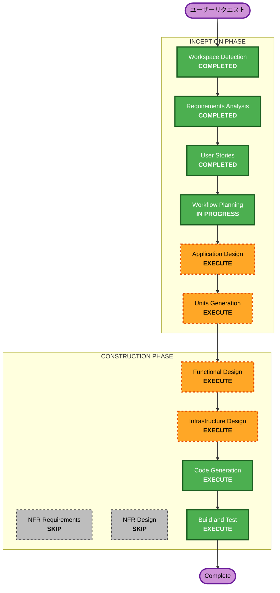

# Execution Plan

## Detailed Analysis Summary

### Change Impact Assessment
- **User-facing changes**: Yes — 新規ゲームアプリ。全機能がユーザー向け
- **Structural changes**: Yes — ゼロからのアーキテクチャ構築（Greenfield）
- **Data model changes**: Yes — ナマケモノ、ナマケコイン、親密度、図鑑、ショップ等のデータモデルが必要
- **API changes**: Yes — フロントエンド↔バックエンドのAPI設計が必要
- **NFR impact**: Low — ハッカソンMVP。ハッピーパス最優先、堅牢性は最小限

### Risk Assessment
- **Risk Level**: Medium — Greenfield + LIFF/LINE Push/演出/動画撮影を含む。技術的な巻き戻しは容易だが、LINE連携の縦串が通るまでは不確実性あり
- **Rollback Complexity**: Easy — 新規プロジェクト、既存システムへの影響なし
- **Testing Complexity**: Simple — ハッピーパスのみ、動画撮影で検証

### リスク対策

| リスク | 影響 | 対策 |
|---|---|---|
| LIFF/LINE Push連携が想定通り動かない | 通知導線が崩壊。キラーシーンの動画が撮れない | 最初のCode Generationで縦串スパイク（LIFF起動→userId取得→Push送信）を実施。ここが通らなければ早期に方針転換 |
| イラスト制作が間に合わない | ナマケモノの見た目が揃わない | プレースホルダー画像で開発を進め、イラストは後差し替え。最悪シンプルなアイコンでもデモは成立 |
| 2週間で14機能すべて実装できない | デモシナリオが不完全 | 優先度: オンボーディング→スワイプ→召喚→収穫→ショップ→贈り物→通知→手紙。手紙は最悪カットしてもコアループは回る |
| DynamoDBのデータ設計ミス | 途中で作り直しが必要 | Greenfieldなのでテーブル再作成は容易。MVP v1はデータ量が極小なので移行コストもほぼゼロ |

---

## Workflow Visualization



### Text Alternative
```
INCEPTION PHASE:
  [COMPLETED] Workspace Detection
  [COMPLETED] Requirements Analysis
  [COMPLETED] User Stories
  [IN PROGRESS] Workflow Planning
  [EXECUTE] Application Design
  [EXECUTE] Units Generation

CONSTRUCTION PHASE:
  [EXECUTE] Functional Design (per unit)
  [SKIP] NFR Requirements
  [SKIP] NFR Design
  [EXECUTE] Infrastructure Design (per unit)
  [EXECUTE] Code Generation (per unit)
  [EXECUTE] Build and Test
```

---

## Phases to Execute

### INCEPTION PHASE
- [x] Workspace Detection (COMPLETED)
- [x] Reverse Engineering (SKIPPED — Greenfield)
- [x] Requirements Analysis (COMPLETED)
- [x] User Stories (COMPLETED)
- [x] Workflow Planning (COMPLETED)
- [ ] Application Design — **EXECUTE**
  - **Rationale**: 新規アプリ。コンポーネント構成、画面構成、API設計、データモデルの概要設計が必要。13のユーザーストーリーを実現するコンポーネントとその関係を定義する
- [ ] Units Generation — **EXECUTE**
  - **Rationale**: フロントエンド・バックエンド・インフラの3つ以上のユニットに分解が必要。2〜3人チームでの並行作業を可能にするため

### CONSTRUCTION PHASE（各ユニットごとに実行）
- [ ] Functional Design — **EXECUTE**
  - **Rationale**: ナマケモノ出現条件判定、ナマケコイン計算、親密度計算、途中離脱ボーナスなど、ビジネスロジックの詳細設計が必要
- [ ] NFR Requirements — **SKIP**
  - **Rationale**: ハッカソンMVP。ハッピーパス最優先。パフォーマンス・セキュリティの厳密な要件は不要。一般公開しない
- [ ] NFR Design — **SKIP**
  - **Rationale**: NFR Requirementsをスキップするため、NFR Designも不要
- [ ] Infrastructure Design — **EXECUTE**
  - **Rationale**: AWSサービスの選定とデプロイ構成の設計が必要。ハッカソンなのでAWS活用は評価対象
- [ ] Code Generation — **EXECUTE**（ALWAYS）
  - **Rationale**: 実装の計画と生成
- [ ] Build and Test — **EXECUTE**（ALWAYS）
  - **Rationale**: ビルド・テスト手順の整備

### OPERATIONS PHASE
- [ ] Operations — PLACEHOLDER

---

## Success Criteria
- **Primary Goal**: 1.5日体験のデモ動画が撮影できる状態のMVP v1を完成させる
- **Key Deliverables**:
  - 動くWebアプリ（AWSにデプロイ済み）
  - 1.5日体験の各シーンの動画素材
  - 15分プレゼン資料
- **Quality Gates**:
  - 13ユーザーストーリー（US-01〜US-13）の受け入れ基準をすべて満たす
  - デモシナリオの全シーンが動画撮影可能
